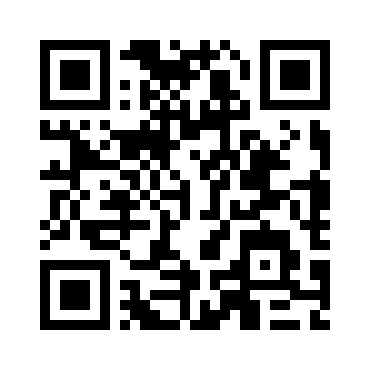

# Support YouTube Playlist Tools

If this extension saves you time, consider supporting its development! 

I'm a solo developer building this as a privacy-first, ad-free, open-source tool. I don't track your data or run ads, so any support goes directly into maintaining and improving the extension.

## ❤️ Donate Crypto (USDT)

You can support me directly using **USDT** on the **TRON (TRC-20)** network.

**Wallet Address:**
```
TFCbepczuZzPBgBs67ZxtXAM9zaeyn9csa
```

*(Click to copy)*



> **⚠️ IMPORTANT:** Please ensure you are sending on the **TRC-20 (TRON)** network. Sending on other networks will result in lost funds.

---

## 🌟 Other ways to help

If you can't donate, you can still help immensely for free!

- ⭐ **Star this repository** on GitHub.
- 📝 **Leave a 5-star review** on the extension store.
- 🐛 **Report bugs** or suggest features in the [Issues](https://github.com/ibhar/YTB_REV_PLAYLIST/issues) tab.
- 🤝 **Share the extension** with friends or colleagues who use YouTube.

Thank you! Every bit of support means a lot.
